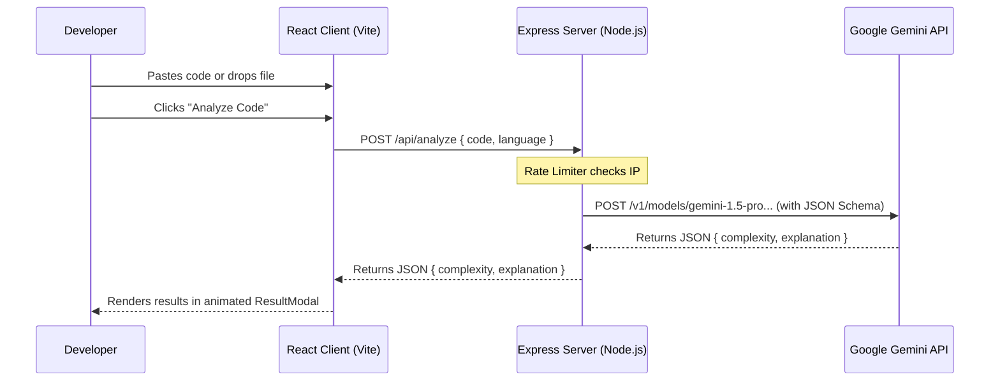

# ⏱️ Time Complexity Analyzer

[](https://opensource.org/licenses/MIT)
[](https://react.dev)
[](https://nodejs.org)
[](https://tailwindcss.com)
[](https://deepmind.google/technologies/gemini/)

> An AI-powered full-stack web application designed to instantly analyze code snippets, determine their Big-O time complexity, and provide detailed mathematical explanations. Built with a modern, glassmorphic UI.

---

## 📖 Table of Contents

- [Project Overview](#-project-overview)
- [Problem Statement](#-problem-statement)
- [Key Features](#-key-features)
- [System Architecture](#%EF%B8%8F-system-architecture)
- [Folder Structure](#-folder-structure)
- [Tech Stack](#-tech-stack)
- [Installation & Setup](#-installation--setup)
- [Environment Variables](#-environment-variables)
- [API Documentation](#-api-documentation)
- [Key Engineering Decisions](#%EF%B8%8F-key-engineering-decisions)
- [Future Improvements](#-future-improvements)
- [License](#-license)
- [Author](#-author)

---

## 🌟 Project Overview

**Time Complexity Analyzer** is a developer tool that uses advanced LLMs to perform static-like analysis on code. Developers paste their code directly into an integrated Monaco Editor (the core editor behind VS Code) or drop their source files. The backend communicates with Google Gemini Pro in **Structured JSON Mode** to guarantee reliable data extraction. The time complexity and line-by-line logical explanation are then displayed in an animated glassmorphic modal.

---

## 💡 Problem Statement

Determining the algorithmic complexity of code is a critical skill for senior engineers, but performing it manually for non-trivial logic can be time-consuming and error-prone. Standard static code analysis tools focus primarily on syntax errors and code smells, omitting performance indicators like asymptotic runtime. 

This project solves that gap by providing a fast, developer-friendly interface that translates complex nesting, recursive calls, and library functions into clear Big-O estimates.

---

## 🚀 Key Features

*   **VS Code-like Monaco Editor**: Built-in editor with syntax highlighting, automatic bracket closing, and spacing control.
*   **Drag-and-Drop File Upload**: Direct parsing of local source files (`.js`, `.py`, `.java`, `.cpp`, `.c`) with visual drop indicators.
*   **Structured AI Analysis**: Queries Google Gemini Pro under a structured JSON schema, ensuring consistent response formatting.
*   **Polished Dark UI**: Beautiful glassmorphic modal overlays, custom scrollbars, and high-performance micro-animations powered by Tailwind CSS v4 and Framer Motion.
*   **Security & Safety**: Express-based rate limiters to shield the backend API and Gemini credentials from billing abuse.

---

## 🛠️ System Architecture

The following diagram illustrates the flow of code analysis requests from the client to the Google Gemini API:



---

## 📂 Folder Structure

```text
Time-Complexity-Analyzer-/
├── client/                 # React Frontend
│   ├── src/
│   │   ├── components/     # UI Components (Monaco Editor, Dropzone, Modal)
│   │   │   ├── ui/         # Shadcn-like visual enhancements
│   │   │   └── ...
│   │   ├── lib/            # Utilities (cn helper)
│   │   ├── App.jsx         # App Entry Component
│   │   ├── main.jsx        # DOM Mount point
│   │   └── ...
│   ├── package.json
│   └── vite.config.js
├── server/                 # Express Backend
│   ├── routes/             # API Endpoints (analyze route)
│   ├── utils/              # Prompt generators
│   ├── index.js            # Express server entry point
│   ├── package.json
│   └── .env.example
├── shared/                 # Shared prompt files across workspaces
└── README.md
```

---

## 💻 Tech Stack

### Frontend
- **React 19** & **Vite**: Ultra-fast hot module reloading and build speeds.
- **Monaco Editor (`@monaco-editor/react`)**: Rich editor capability in the browser.
- **Framer Motion**: Smooth entry/exit animations for modals and tab transitions.
- **Tailwind CSS v4** & **PostCSS**: Sleek dark-theme layout styling.

### Backend
- **Node.js** & **Express**: Lightweight API server.
- **Axios**: HTTP communication with the Gemini Developer API.
- **Express Rate Limit**: Anti-abuse security layers.
- **Dotenv**: Standard environment configuration management.

---

## ⚙️ Installation & Setup

### Prerequisites
- Node.js (v18 or higher)
- npm (v9 or higher)
- A Gemini API Key (get one from [Google AI Studio](https://aistudio.google.com))

### 1. Backend Installation
Navigate into the server directory, install dependencies, and set up your environment variables:
```bash
cd server
npm install
cp .env.example .env
```
Open `.env` and fill in your Gemini API key:
```env
PORT=5000
GEMINI_API_KEY=your_actual_gemini_api_key
```
Start the local server:
```bash
npm start
```
The server will run on `http://localhost:5000`.

### 2. Frontend Installation
Navigate into the client directory and install dependencies:
```bash
cd ../client
npm install
```
Start the frontend dev server:
```bash
npm run dev
```
The app will open automatically on `http://localhost:5173`. If you want to point the client to your local server instead of production, set the environment variable:
```bash
VITE_API_URL=http://localhost:5000 npm run dev
```

---

## 🔑 Environment Variables

The server requires the following configuration in a `.env` file at the root of the `server/` directory:

| Variable | Description | Default | Required |
| :--- | :--- | :--- | :--- |
| `PORT` | The port the Express backend runs on. | `5000` | No |
| `GEMINI_API_KEY` | Developer access token for Google Gemini AI. | N/A | **Yes** |

---

## 📡 API Documentation

### Analyze Code Complexity
Performs static-based AI analysis on a code snippet.

- **URL**: `/api/analyze`
- **Method**: `POST`
- **Headers**: `Content-Type: application/json`
- **Request Body**:
  ```json
  {
    "code": "for (let i = 0; i < n; i++) { console.log(i); }",
    "language": "javascript"
  }
  ```
- **Response Example (`200 OK`)**:
  ```json
  {
    "complexity": "O(N)",
    "explanation": "The code contains a single for-loop that runs from 0 to n. Inside the loop, it performs a constant time console.log operation. Hence, the runtime scales linearly with the size of input n."
  }
  ```
- **Error Responses**:
  - `400 Bad Request`: If code or language is missing.
  - `429 Too Many Requests`: If request limits are exceeded.
  - `500 Internal Server Error`: If the Gemini API request fails.

---

## 🛠️ Key Engineering Decisions

### 1. JSON Schema enforcement (Gemini JSON Mode)
Instead of returning unstructured markdown text and matching it with fragile regexes, the API uses Gemini's `generationConfig` with `responseMimeType: "application/json"`. We define a JSON Schema containing `complexity` and `explanation` properties. This ensures the output format is deterministic and never breaks.

### 2. Client-IP Rate Limiting
To prevent cost abuse, we implemented `express-rate-limit` on the Express API. It allows up to 50 requests per 15-minute window per IP, which protects developer budgets while maintaining a generous tier for manual experimentation.

### 3. Editor Isolation
Using `@monaco-editor/react` isolates the code editor instance from React's state lifecycle. This avoids re-rendering the heavy editor component on every keystroke, resulting in a buttery-smooth 60fps typing experience.

---

## 🔮 Future Improvements

- [ ] **Database Caching**: Store hashes of analyzed code snippets in Redis/MongoDB. If a developer runs the exact same code, return the result instantly without calling the Gemini API.
- [ ] **Detailed Chart Visualization**: Implement charts using Recharts showing growth comparisons ($O(1)$ vs $O(N)$ vs $O(N^2)$) dynamically based on the returned complexity.
- [ ] **Token Estimation**: Visual display of code token count prior to sending, ensuring it fits LLM context limitations.

---

## 📄 License

This project is licensed under the MIT License - see the [LICENSE](LICENSE) file for details.

---

## 👤 Author

**Praveen T**
*   GitHub: [@Praveen8760](https://github.com/Praveen8760)